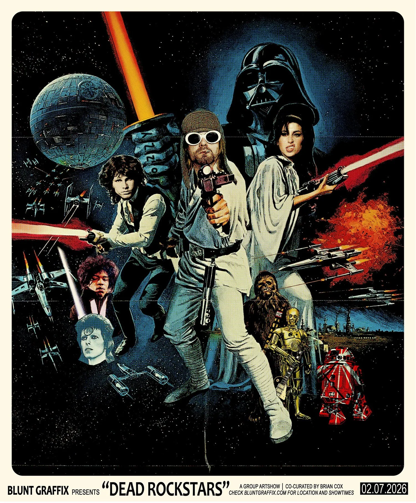
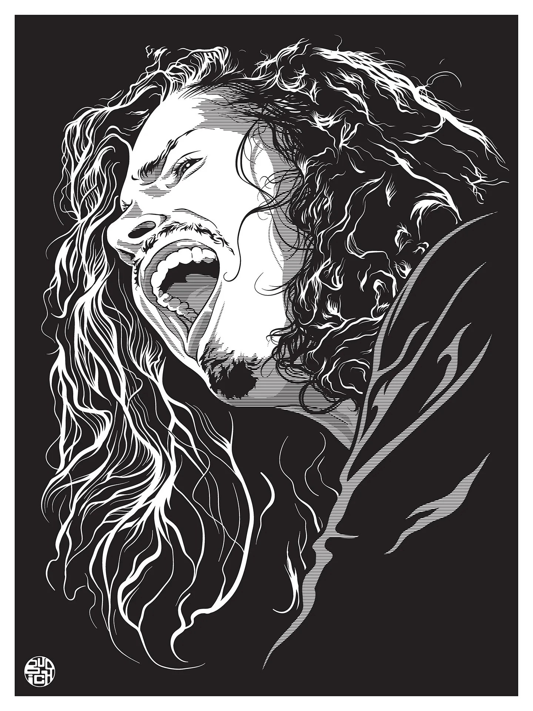
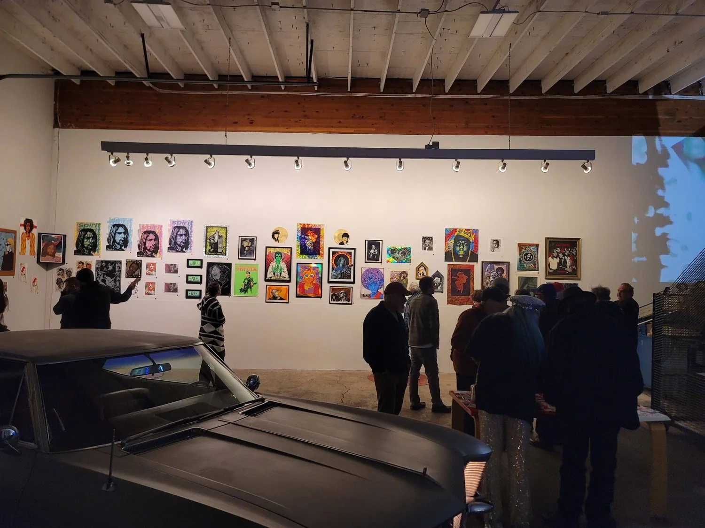

[Home](../Home.md) / [Features](../Features.md) / Dead Rockstars <!-- wikidown:breadcrumb -->

# Dead Rockstars

*February 7th, 2026, at Blunt Graffix*

**This February Art Hop features a not-to-miss show returning to Blunt Graffix: Dead Rockstars, a pop art tribute show organized by Matt Dye and Brian Cox, honoring the artists, especially the rockstars, who have come before us.**

> "We are paying homage to these great artists who've passed away and doing it in our own way."

says Dead Rockstars contributing artist Joshua Budich.

*Dead Rockstars event poster by Matt Dye of Blunt Graffix.*

The first Dead Rockstars show occurred back in 2012 in Eugene, before traveling to San Francisco and then Seattle. This 2026 iteration of Dead Rockstars features some artists from the original show, as well as new ones. Many of whom have been in communication online for years, through the pandemic, and over time, who have yet to actually meet in person. When asked about what he's most looking forward to about the show, Blunt Graffix artist Matt Dye says he's looking forward to

> "Meeting everyone. Some of the artists are going to attend the show. Some of them I've known for over 20 years, but we've never met in person... and then meet the fans... in person, because [we've] known a lot of these people online for a long time."

I had a chance to catch up with one of the longer distance artists participating in the show, Joshua Budich, a pop artist based in Baltimore, MD. Budich echoed similar sentiments that Dye did when asked why pop art? and why Dead Rockstars?

> "Well the subject matter for the show was something I was already exploring on my own. There seems to be a great tradition in pop art to harken back to heroes and musicians and artists who've passed away."

The rockstars who shaped our childhoods, our youth, the youth of our parents, those who've contributed to the shape and cadence of music as we now know it. Dead Rockstars features over 40 artists from around the country. Whether you're a concert poster collector, a music or screenprinting fanatic, you appreciate high quality illustration, or you just plain want to spend your Saturday night listening to live music and mingling with artists and art fans, this show is for you.

*A tribute to Chris Cornell by Joshua Budich.*

> "When Matt came to me and said I'm doing a show called Dead Rockstars, I, like a lot of the other artists, had already been doing homages to musicians especially who we loved and who had passed away. And I think Dead Rockstars was just an on point and concise name, [albeit] a little morbid... but also it's the truth."

In closing I asked Dye if there was anything else he'd want to share about the show and he said:

> "Yeah. Come see the show!"

Enough said. We hope to see you out there!

*Image from the show, courtesy of Blunt Graffix. Also, let's have more art shows with vintage cars as decor, shall we?*

On February 7th, amid visiting Jerry Williams' new show at The Oblivion Gallery and stopping by Switch Gallery to view the artworks of guest artist Kyle Flannery or resident artist Ryan Kramer, we invite you to end your Hop at Blunt Graffix for this super special group show.

Dead Rockstars will be open at Blunt Graffix on Saturday, February 7th from 5:00 to 10:00 PM during The Art Hop. Dead Rockstars is a group show produced by Brian Cox and Matt Dye. The show also features live music from the Girin Guha Experience.

Blunt Graffix is at [3709 W 1st Ave, Eugene, OR 97402](https://maps.app.goo.gl/PHCmk6iRES7nBkE5A). See the [Blunt Graffix venue page](../Venues/Blunt-Graffix.md).

*January 28, 2026. Written by Art Hop organizer Sarah Bush.*

If you'd like to contribute photos or writing to The Art Hop please send submissions to warehousedistrictarthop@gmail.com. We would love to include your contributions.
