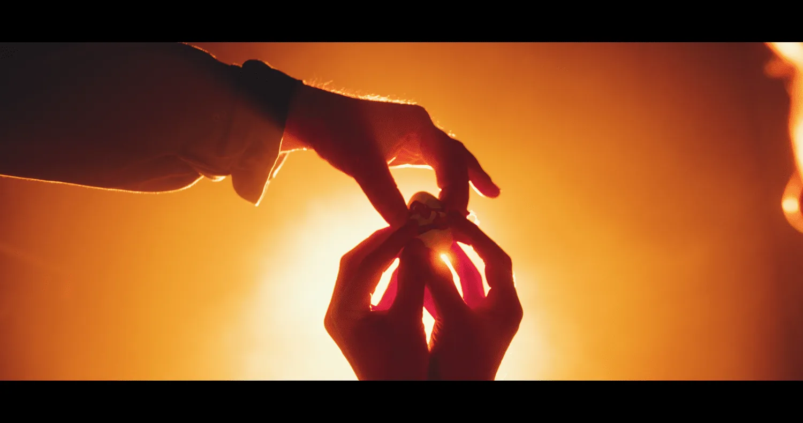
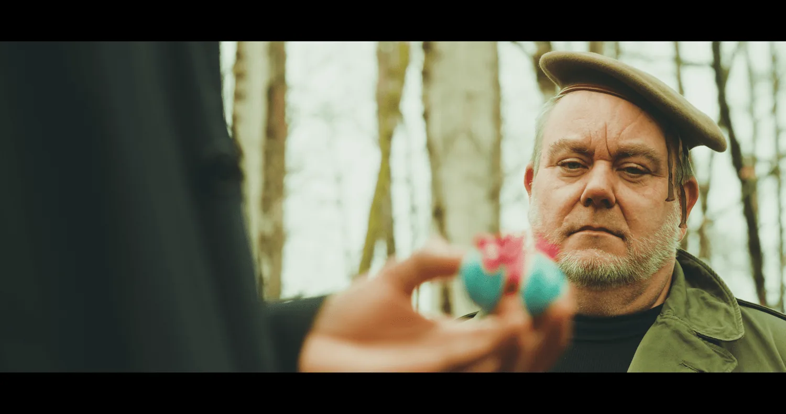

[Home](../Home.md) / [Features](../Features.md) / Easter The Show <!-- wikidown:breadcrumb -->

# Easter The Show

*April 4th, 2026, at Caffe Pacori*

**The April 4th Art Hop is upon us and we can't wait to experience Cowdog Productions' special event, Easter The Show, at Caffe Pacori. Join Thor Slaughter alongside an incredibly talented cast of entertainers for a one-of-a-kind semi-secular Easter-inspired show that will leave you saying to yourself "dang, there was a lot of dip on that chip."**

*Still from one of the short films debuting during Easter The Show.*

I sat down with Thor Slaughter of Cowdog Productions last week to get the download on what we could possibly expect from this wild production called Easter The Show. I had all kinds of questions, of course. One of the most pressing was: who is this show for? And what is Easter The Show?

Easter The Show is a variety show of sorts, based off the format of The Muppet Show. There will be everything from puppets, to Broadway-worthy skits, short films and even educational punk rock. There's an emcee, a house band, and a talented cast of performers, all bringing their own flavor and interpretation to the experience.

> "Everyone involved is insanely talented."

Throughout the interview, Slaughter's enthusiasm not only for the show itself, but also for his collaborators was keenly felt. He didn't miss a beat in crediting all of the people who are bringing something to the table to make this show come to life. His enthusiasm for the show is infectious.

It's clear how Thor has found such great collaborators. The first time I met him, his vision was infectious and his drive to see something come to life was inspiring. (Frankly, I was inspired to get involved with Easter The Show myself the first time I heard Thor talk about it.)

> "I've developed really strong relationships with collaborators and that's probably what I'm most proud of, that I have people that trust me. I can call someone and be like 'I want to do a weird Easter event, are you in?' And people will be like 'yes.' So I'm very proud of that, that people think my work is good enough that they want to work together in tandem on it."

> "I want it to be bizarre, and open to everyone."

> "If you weren't there you'll just have no idea what it was."

Catch Easter The Show live at Caffe Pacori during The Art Hop at 4:00 to 6:00 PM, Saturday, April 4th. (That's 4/4 at 4.) See you there!

Caffe Pacori is at 255 Wallis St, Ste 3. See the [Caffe Pacori venue page](../Venues/Caffe-Pacori.md).
