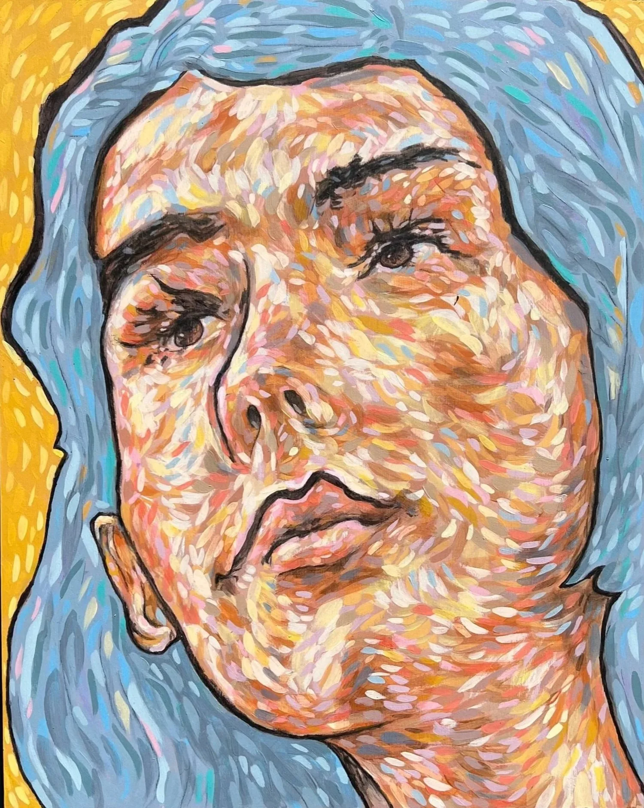
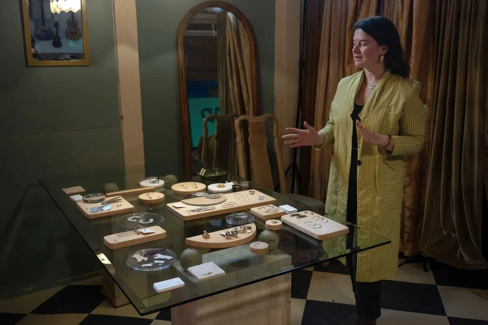
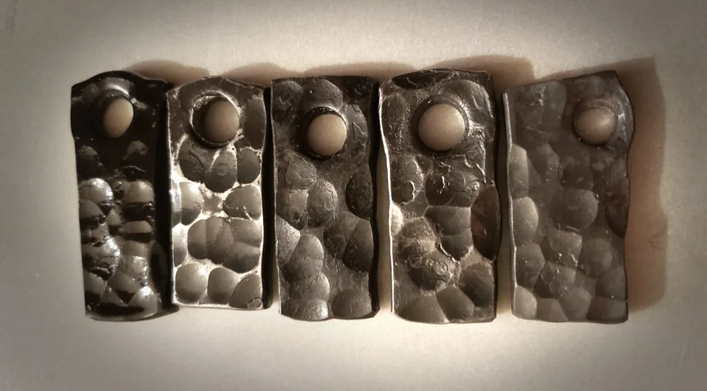
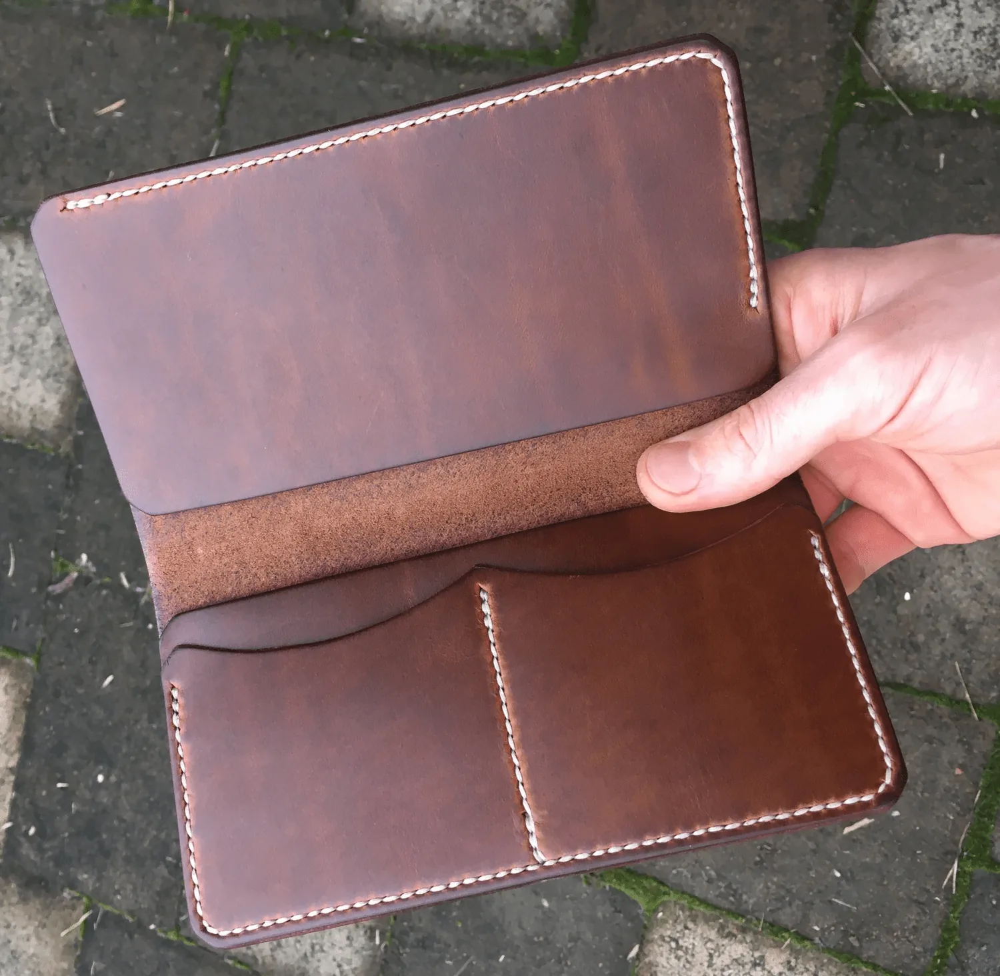
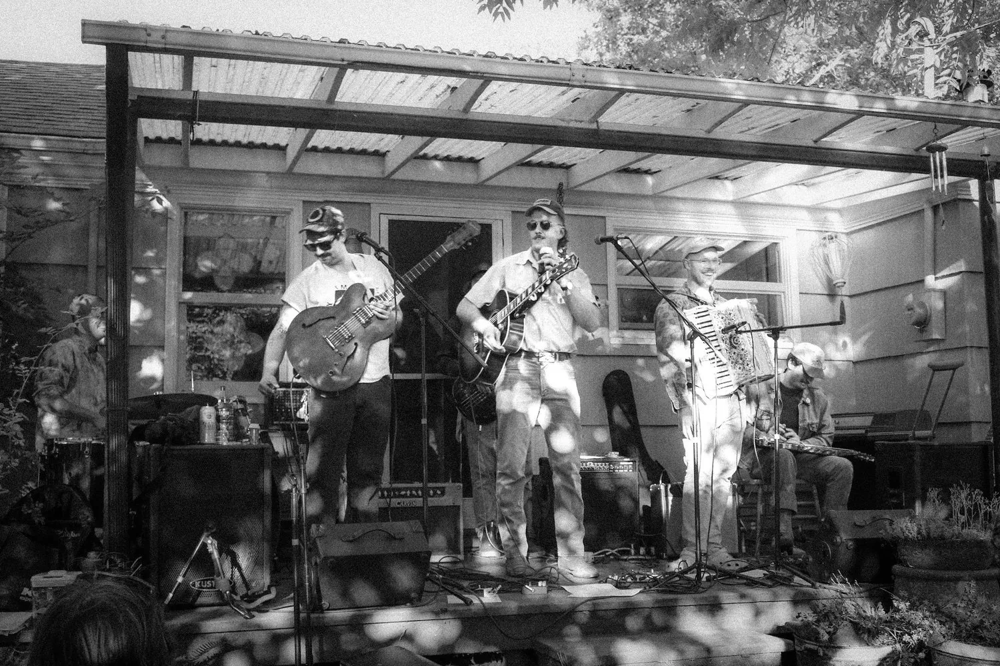
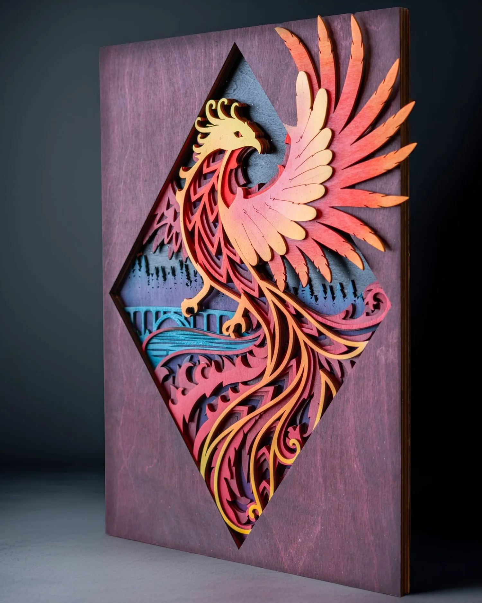

[Home](../Home.md) / [Features](../Features.md) / Pinebox Night Market <!-- wikidown:breadcrumb -->

# Pinebox Night Market

*March 7th, 2026, at Pinebox Collective*

**Warehouse District artists and venues open their doors on Saturday, March 7th to welcome visitors for this month's Warehouse District Art Hop. This month we are featuring Pinebox Collective as they present their event, Pinebox Night Market.**

*Portrait painting by March Pinebox Night Market artist [Bret Pendlebury](https://www.bretpendlebury.com/).*

The Pinebox Night Market is a new micro-market at [Pinebox Collective, 575 Garfield St.](https://maps.app.goo.gl/DuvAdKbE9ki3uZEg9), hosted by local jewelry artist FRIPP, that was launched in December of 2025.

> "The Pinebox Night Market was born out of years of experience at different markets in town and along the West Coast. It's designed in response to what I wished I was experiencing at markets: more coziness, more connection, less overwhelm, and as a vendor, more manageable hours."

Bush cited visiting Hong Kong during her past career as a jewelry designer for another brand and the night market that took place there. "There were these two, super narrow, six story buildings that flanked a courtyard. Each story of each building housed a row of about 10 artist studios and gallery spaces. These were all open for visiting, and then down in the courtyard there was a lively table-vending style market that ended with a horseshoe of food and drink vendors. There was dancing, and in the air above the courtyards was a multi-story installation of thousands of golden origami figures that hung in the shape of a goat. It was the year of the goat. I've thought of that scene so many times since and it's totally my inspiration for cultivating a Night Market experience here."

*Sarah Bush of FRIPP jewelry in her studio at Pinebox Collective during the February Art Hop last month. Photo courtesy of Glenn Newland.*

Pinebox Collective is an eclectic and charming artist studio and workshop space at the east side of the Warehouse District that is organized by Josiah Martens of Pinemarten Building Co., with additional residents Teal Pulcifer, Adam Junod (Good Creative) and Sarah Bush (FRIPP jewelry, Art Hop).

> "What we are creating at Pinebox Collective is an attempt at beating this drum of celebrating art, music and creativity in all forms in community."

Pinebox Collective is part studio, part woodshop and part creative gathering space. They host a weekly open mic and simultaneous open studio event on Wednesdays, welcoming creatives of all kinds to bring something to work on or bring some words or music to share. Get in touch with them directly at the Art Hop this month!

In this current day where tech is necessary for more or less all artists to make a living, where AI is profoundly present, and where what's "real" is becoming more confusing, we are also witnessing this opposing force of craving for connection in real life.

*Hand forged steel tags by Charles Persson.*

"We may be absolutely thrilled to kick up our heels at the end of the evening, [enchanted by the classic country tunes of Emerald City Roadkill] but to be honest the creative nerd in us is perhaps equally as stoked for the interactive blacksmithing demo that is happening during the market."

Don't miss Cottage Grove blacksmith Charles Persson's live blacksmithing demo during the Market (open 4 to 8 PM)! He may even let you take a whack at some red hot steel.

If you haven't previously checked out Walling and Sons leatherwork, you're in for a treat. This may be the last wallet you'll ever need. Find Dan at this month's Night Market.

## This Pinebox Night Market features eleven local artists and craftspeople and is followed by live music and two-step lessons by country music locals Emerald City Roadkill.

*Emerald City Roadkill is a six-piece band from country music's "Emerald City": Eugene, Oregon.*

An island of electrified country music in Eugene's sea of bluegrass, they play a highly danceable mix of classic and original tunes drawing from honky-tonk, western swing, country blues and conjunto traditions.

On March 7th during the Art Hop, before you make your way to the night market, be sure to check out the latest work at [Shadowfox](https://maps.app.goo.gl/1KPcnAA7BqTC7AtY8) (and if country music isn't your thing, they'll be closing out their evening with a DJ and firespinning from sundown to late). Also not-to-miss this month is [Wheelhaus Arts](https://maps.app.goo.gl/53kgDSPZ1fyyzL4C6)! Studio lead and community arts visionary David Placencia is typically showing the work of his young students (which is delightful in every way) but this month we get to enjoy a show of his work!

We can't wait to see you out there for another special Warehouse District Art Hop.

Pinebox Night Market will be operating from 4 to 8 PM on Saturday, March 7th. The night market will make a swift transition to clear the dancefloor and close the night in smooth country serenade by Emerald City Roadkill beginning around 8:30 PM.

Pinebox Collective is located at [575 Garfield St, Eugene, OR 97402](https://maps.app.goo.gl/DuvAdKbE9ki3uZEg9). See the [Pinebox venue page](../Venues/Pinebox.md).

*Original sculptural painting by Jason Pancoast of Shadowfox.*
