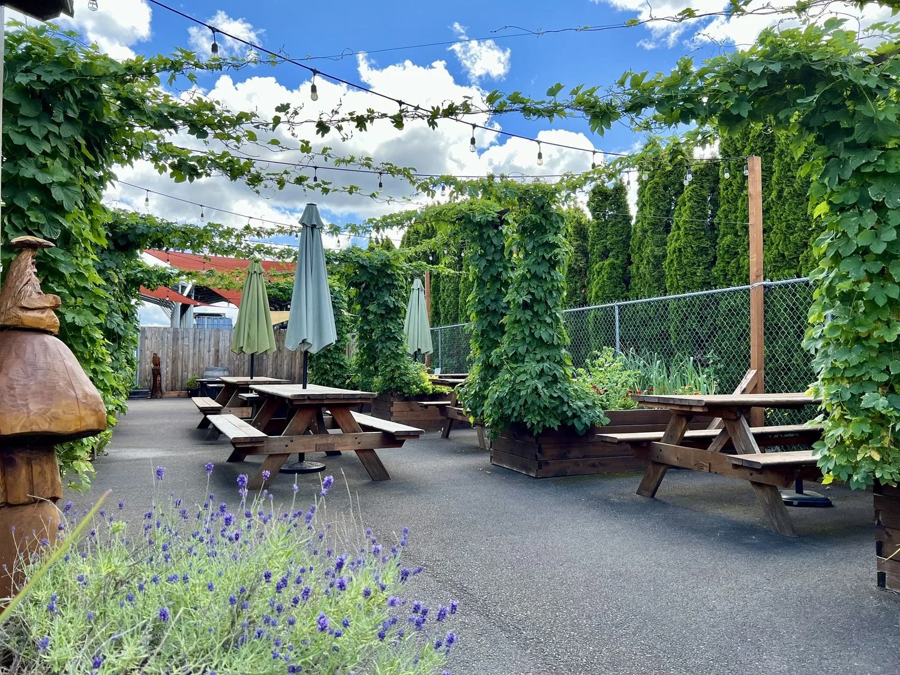
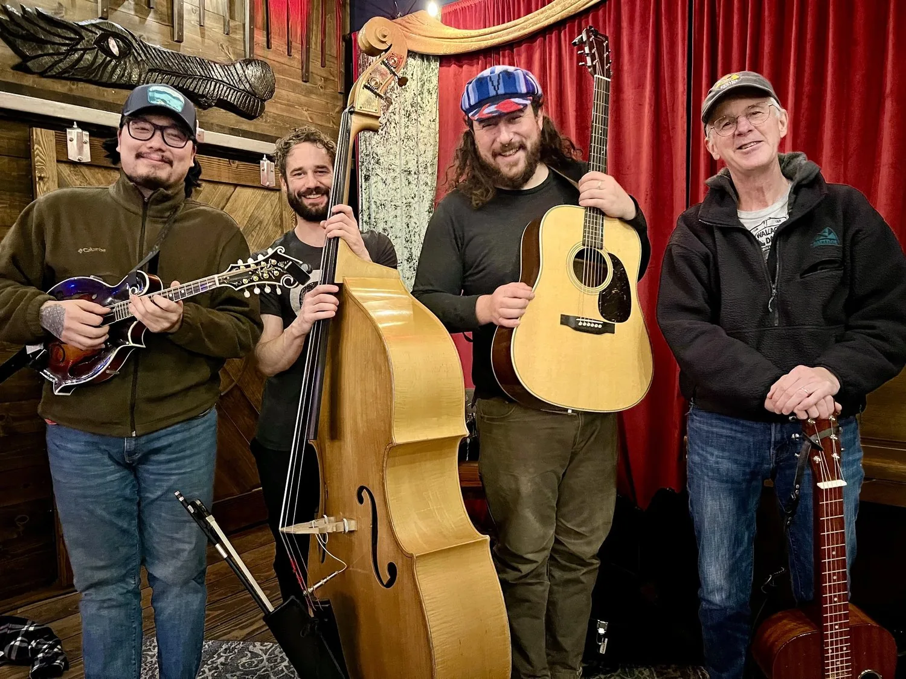
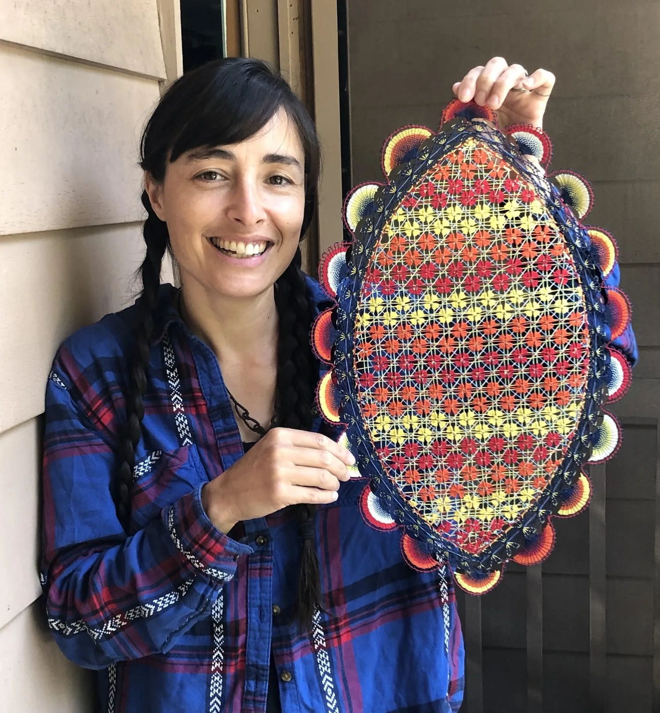
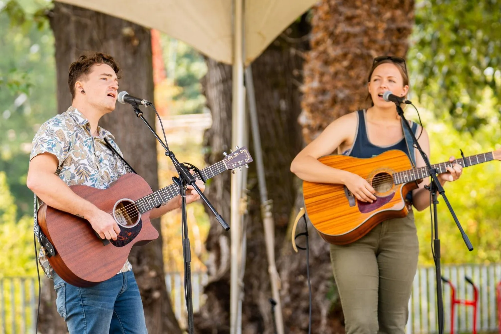
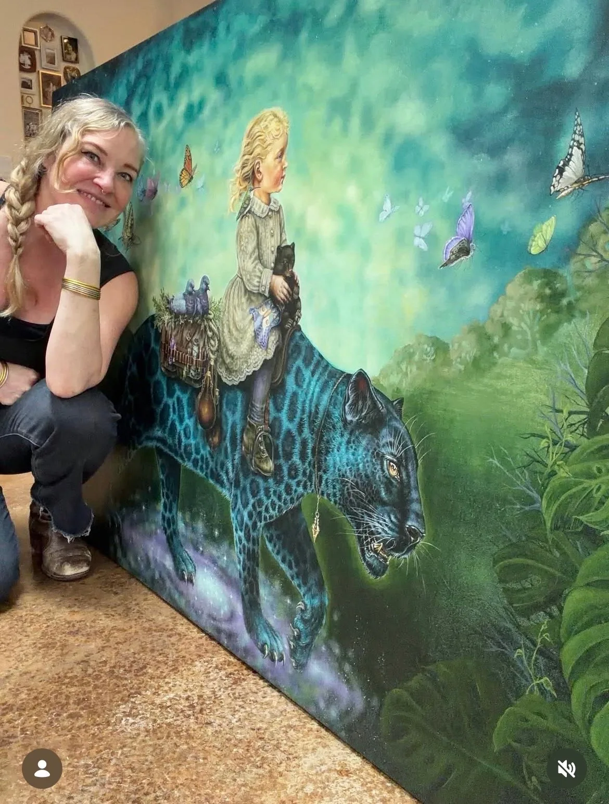

[Home](../Home.md) / [Features](../Features.md) / Viking Brewing <!-- wikidown:breadcrumb -->

# Viking Brewing

*May 2nd, 2026, at Viking Brewing*

**As summer approaches, through a patio dripping in hop vines sits one of our founding venues, Viking Brewing Co. You'll find this gem nestled at the end of Commercial Street, deep in the west end of the Warehouse District.**

*Hops in full ascent at the Viking Brewing patio last summer. (They're well on their way already this year!)*

One of the most important things to the vitality of the arts in this town is having public spaces to share in: to share music, to share visual art, and to come together over food and drink, in community, IRL (in real life). While we're completely stoked to open our art studio doors to the public for the Art Hop, we are equally as grateful for the spaces that operate as venues for art and music, too.

Viking Brewing Company, led by Jonna Threlkeld and founded by her husband Dan McTavish in 2013, has become a Warehouse District hub of live music and community gathering, but that vision has unfolded over time.

> "The music is really the reward for me."

I loved chatting with Jonna about her experience overseeing the dream of Viking Brewing, which has evolved from a barebones brewing operation among friends, to a South Eugene eatery, and in its current iteration is most fueled up by its relationship with musicians and artists alike. Jonna is also a member of Eugene string band Bake Club.

After Covid raked the brick and mortar restaurant scene, Viking found itself needing to adapt.

> "When that decision was presenting itself, for me it just really felt like this gut feeling that we can't give up the brewery. This is the winter of saving the brewery. We have to do live music out here."

One of the characteristic qualities you'll find in all Warehouse District artists and entrepreneurs is this robust passion they have for rolling their sleeves up and committing to the dream. The owners of Viking are examples of this spirit. They've built something from the ground up and through passion and grit, through Covid of all things, and way out off the beaten path. They've created community, a place to share art and music, and something that we feel so grateful to have as a part of The Art Hop.

*Romanelli Revival will be closing out the night this Saturday, May 2nd, at Viking.*

I had a chance to connect with musician Peter Romanelli about his experience working with Jonna and Viking over the years. He shared: there are a few things that really make a venue stand out. Jonna has these offerings of experience-based knowledge, both from being in a band and in holding down a comfortable bar space, that make her kind of a "superhero" in those regards.

> "She's doing it all, and I think there's just a lot of care. I think she's good at seeing peoples' strengths and empowering people to do what they want with the space, within her boundaries."

Romanelli has been playing shows for over a decade and performing on Viking's stages since 2018.

This month at Viking, Jonna is inviting back Peter Romanelli (frontman of The Muddy Souls) with his newer project Romanelli Revival. Pete invited in friend and visual artist Cristal Waterhouse to share the walls with painter Shanna Trumbly.

Cristal's work is an expression of the Paraguayan art form called ñanduti, a fusion of Spanish lace and Paraguayan color and patterns. Ñanduti means "spider web" in Guarani, the official language of Paraguay. Gorgeous, vibrant colors are woven to create these intricate, entrancing webs. Cristal grew up around this art form, with her family being from Paraguay. She is proud to carry this art from her lineage and to share it with the world. Make sure you check out Cristal's work this Saturday at Viking!

*Cristal Waterhouse with one of her artworks.*

Sharing the stage on Saturday with Romanelli Revival is local duo Bootleg Rose.

> "They'd really been trying to figure out a date to get on a bill with Bootleg Rose, who are just incredible. Their vocal harmonies are just otherworldly."

*Bootleg Rose opens for Romanelli Revival this Saturday at 6 PM.*

For the months of April and May Viking has also been hosting the incredible work of local painter Shanna Trumbly. Be sure to take a close look at her paintings while you're in the taproom!

> "Shanna Trumbly is doing a two month residency here, so she's gonna split the wall space with Cristal and she's also really excited about that."

> "She's such a business mind, and such a community mover-shaker."

When I was talking with Jonna about the show this weekend she shared not only admiration for Trumbly's work, but for her as a person. Shanna is also putting together a special event next weekend (on Mother's Day), May 10th. Check out Mama Fest, a full day at Viking with incredible artists, women-fronted bands, and of course food and bev by Viking Brewing.

*Shanna Trumbly posing with a recent (mindblowingly detailed) painting.*

Viking Brewing is at 520 Commercial St, Unit F. See the [Viking Brewing venue page](../Venues/Viking-Brewing.md).
