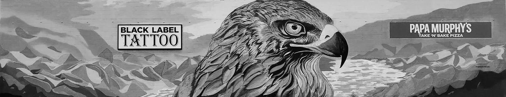
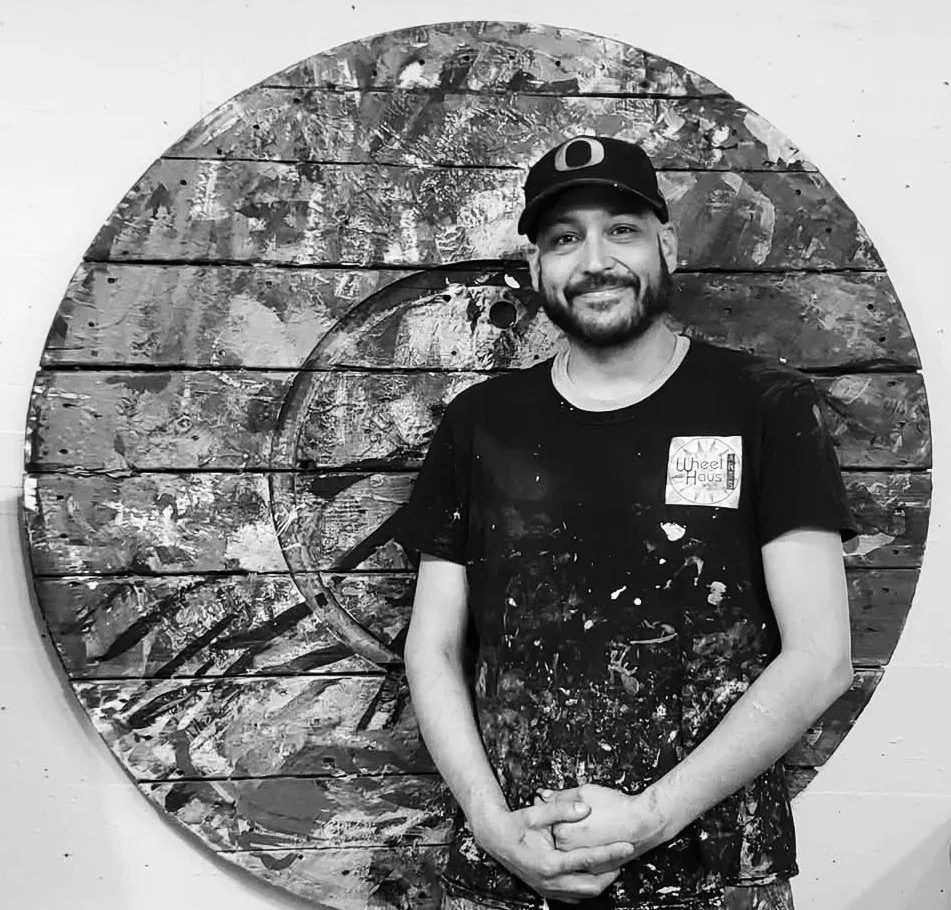
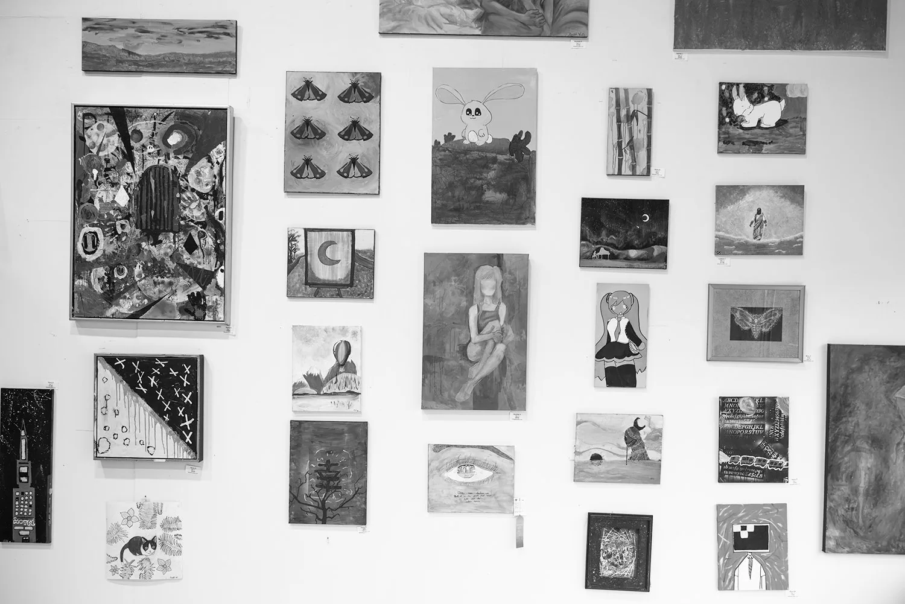

[Home](../Home.md) / [Features](../Features.md) / Wheelhaus Arts <!-- wikidown:breadcrumb -->

# Wheelhaus Arts

*July 4th, 2026, at Wheelhaus Arts*

**Wheelhaus Arts is a youth arts space run by local painter and muralist David Placencia.**

Tucked in the northwest corner of the Warehouse District you'll find the new location of Wheelhaus Arts: a vibrant youth arts center where learning the skills for how to become an artist, and what it's like to be a professional artist, are honed.

David's journey as an artist began with his mother, who integrated art making into his life from an early age. At age 11 David sold his first artwork in a community college critique. It was then that the opportunities that art could provide him really clicked. Not only was he making friendships and personal connections through this creative process, but it also could provide work, a job even.

> "I decided to create a true working studio space experience that most artists get in college but to try to bring that teaching to a younger age. It started with high schoolers, and then... every year there was another young one who asked 'am I too young to join?'"

David started mentoring and teaching young artists around 2006, through the Lane Arts Council and Hamlin Middle School. Years later, he graduated from the U of O and started crafting the plan for what has now become Wheelhaus Arts.

Wheelhaus Arts summer programs have grown from one summer camp session to four now due to demand. David is proud of the diverse group of students he serves, with students ranging from age 5 to 18, and coming from as far as Florence, OR.

Wheelhaus students have an opportunity to become apprentices and get to work alongside a professional working artist and see what that process and experience is like.

> "Many of the students after they attend for a few years end up attending for free as long as they help maintain the studio."

*A mural by Placencia. For full color visit in person! Check number 13 on The Art Hop map.*

> "I think it's almost a part of being a professional artist is to try to bring up the next generation."

*Local muralist and youth arts educator, David Placencia.*

## Fun is fun!

...Something David says often. Orienting to play in the process of art making has an immense positive impact on the creative process.

Wheelhaus Arts is celebrating their grand opening in the Warehouse District this Art Hop. Boxes are unpacked and supplies and artworks are fully moved in. There will be interactive art and craft stations, Wheelhaus merch, and hot dogs!

> "We have award-winning artworks here from children. It'll be a blast. Many of the students will be there."

As you explore The Art Hop today we encourage you to stop by Wheelhaus Arts, check out David's work as well as the work of many of his students. You can meet the young artists too! As David says, "Come support the next generation of local artists!" We hope to see you there!

Wheelhaus Arts is at 125 Cap Court, Unit E. See the [Wheelhaus Arts venue page](../Venues/Wheelhaus-Arts.md).
