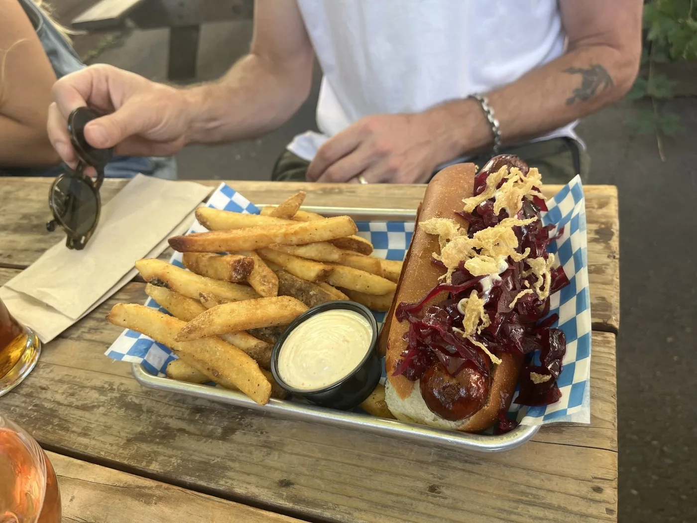
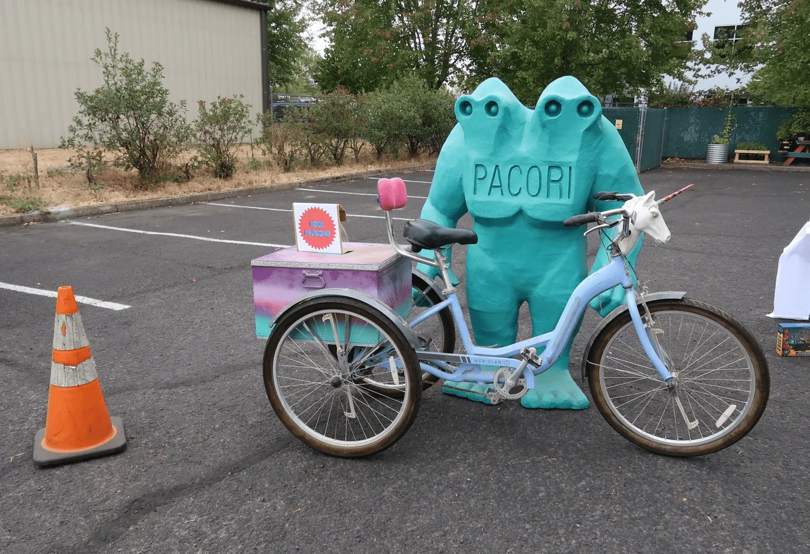
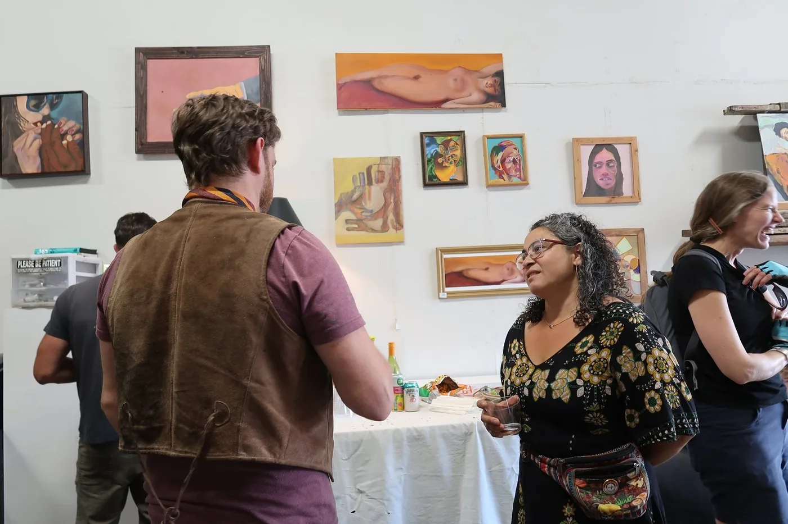
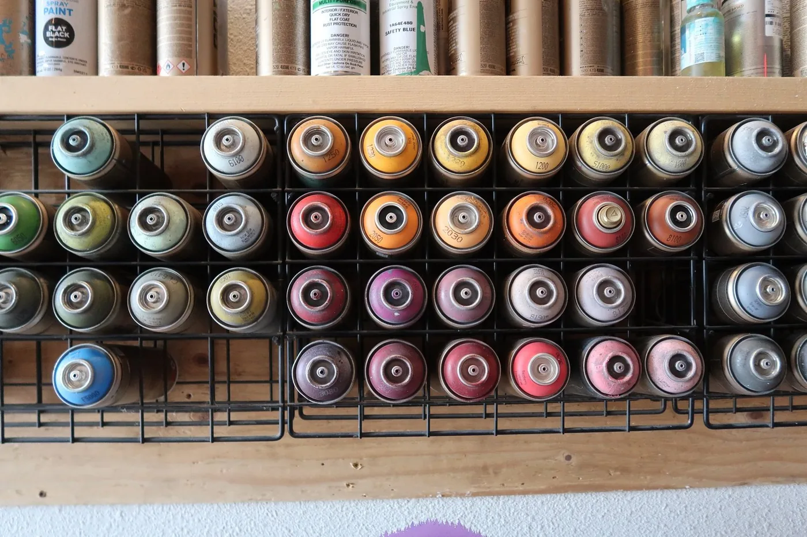
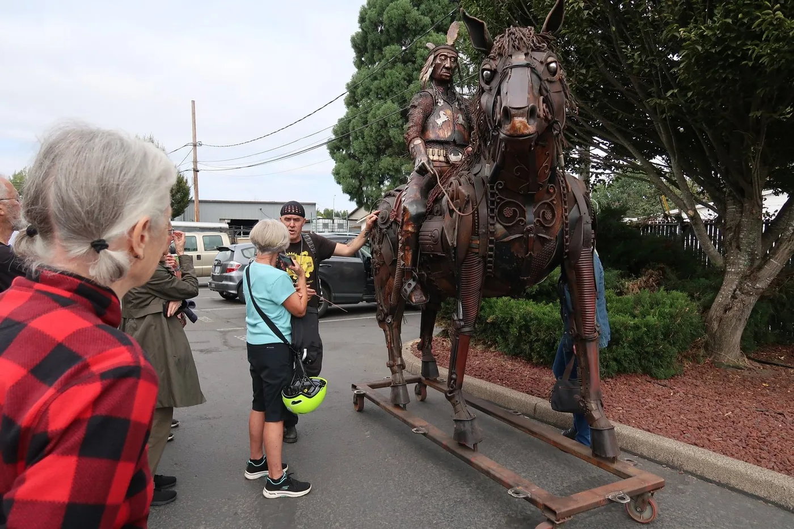

[Home](Home.md) / Highlights <!-- wikidown:breadcrumb -->

# Highlights

<!-- Each paragraph below is one tile on the home page. Put the image first, then the caption, in the same paragraph. -->

01 Epic eats at Viking Brewing. Seriously, the food was so good. After biking around for a few hours we were so grateful to land there for an early dinner.

02 The coolest mascot at Caffe Pacori, also home of Eugene's coolest bathroom.

03 Art Hoppers converse at The Switch Gallery.

04 The Shadowfox Studio is a feast for the eyes. While the spray paint wall is certainly not the most important feature, it is definitely satisfying to look at.

05 The group bike ride arrives at The Oblivion Gallery to check out Jud Turner's P'Squosa Chief sculpture before it is delivered up to Wenatchee later that week.
